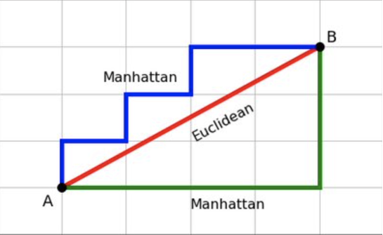
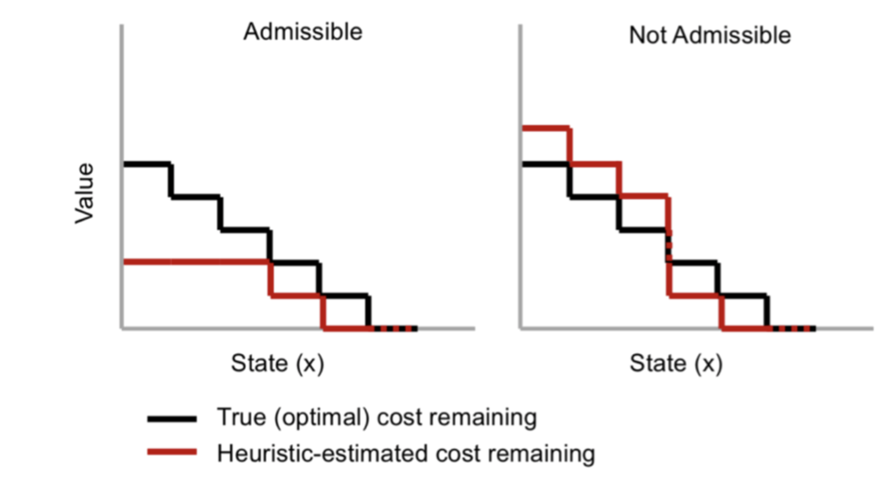
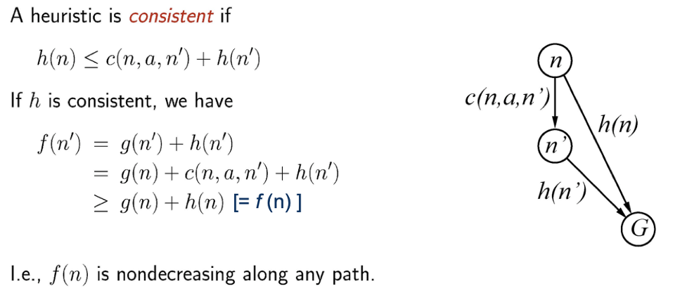
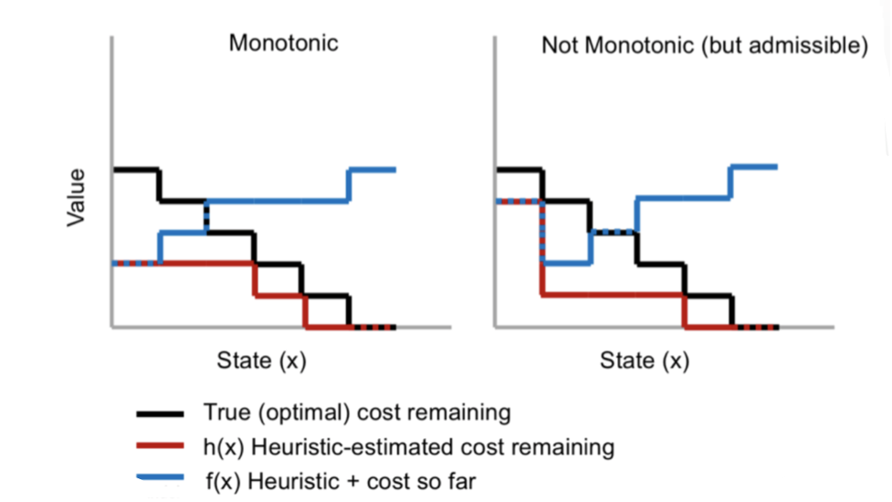
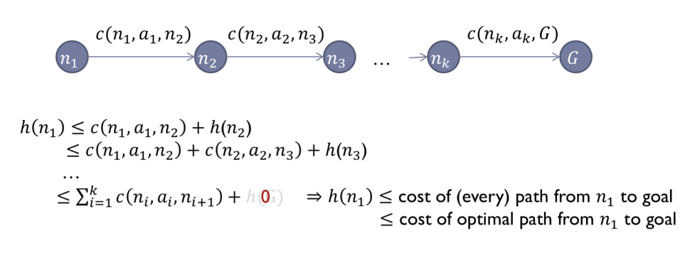
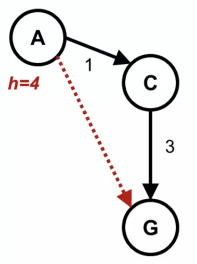

# Advanced Heuristic
#### Kahbod Aeini, Mohammadreza Daviran and Sepehr Kianian

First we review some basic definitions

* Distance is a numerical measurement of how far apart objects or points are.
* [Euclidean Distance](https://en.wikipedia.org/wiki/Euclidean_distance) calculates the distance between two real-valued vectors.
* Manhattan Distance is sum of the absolute differences of their Cartesian coordinates.

* Heuristic guidance means how far is the goal state from a given state approximately.

***Admissiblity of a heuristic function means value of the function is always a Lower Bound of the remaining cost.***

So an **Admissible Heuristic** is a *non-negative* function h of nodes, where **h(n)** is *never greater than the actual cost of the shortest path from node n to a goal.* thus it means that the cost to reach the goal is never overestimated.

Effect of **Admissibility** on a Heuristic is shown in the below schema:

Now we define **f(n)** function as **f(n) = h(n) + g(n)** where g(n) is sum of costs from root to n node.

***Monotonicity or Consistency is that the heuristic function holds in triangle inequality.*** Namely **f(n) is never Decreasing.**

Effect of **Monotonicity** on a Heuristic is shown in the below schema:

We will prove that **Consistency** implies **Admissibility** whereas the opposite is not necessarily true.

Now we want to show an **inconsistent, admissible example!**
So consider this figure:

If our heuristic is admissible, we have that **h(n) <= h*(n)** for every node n where **h*** is the real cost to the goal. So we deduct that **h(A) <= 4**, **h(C) <= 3** and **h(G) <= 0**.

If we want our heuristic to be *Consistent* we should have **h(G) = 0** and **h(n) <= cost(n, c) + h(c)** so in our case we have **h(A) <= 1 + h(C)** and **h(C) <= 3 + h(G) = 3**

Because of the *Admissibility* **h(C) should be less than 3**, but if **h(A) > 1 + h(C)** then our heuristic is *Inconsistent!*. Hence if we assume that **h(C) = 1**, **h(G) = 0** and **h(A) = 4** our heuristic is *Admissible but Inconsistent!*

We also can make a non-monotonic heuristic, monotonic with some changes!
For this we only need to define a new and more appropriate heuristic like the below schema.

**$\overline{h}$(n’) = max(h(n’), ℏ(n’) - c(n, a, n’))**

Above Heuristic is defined Recursively.

**$\overline{h}$(n’) >= $\overline{h}$(n) - c(n, a, n')**

So obviously we have **$\overline{h}$(n’) + c(n, a, n') >= $\overline{h}$(n)**

***Heuristic Dominance***

For one heuristic to dominate another, all of its values must be greater than or equal to the corresponding values of the other heuristic.
So if $h_{2}$ dominates $h_{1}$(both are admissible) it means that A* algorithm expands less nodes with $h_{2}$ in the target path than $h_{1}$.
On another hand it means if a node is expanded by $h_{2}$ it will be expanded by $h_{1}$(consider that it’s not a biconditional proposition!)

*Proof:*

If $h_{2}$ dominate $h_{1}$, A* with $h_{2}$ expands at most the same number of nodes as when using $h_{1}$.

A* opens all node with **f(n) < C** and some with **f(n) = C**.

Note that **$h_{2}(n)$ >= $h_{1}(n)$**

If node n is expanded by A* with $h_{2}$ then **$h_{2}(n)$ < C - g(n)**

So ***$h_{1}(n)$ <= $h_{2}(n)$ < C - g(n)*** and it would be expanded by A* with $h_{1}$ as well.

We also can improve our heuristic by some methods.
We are always